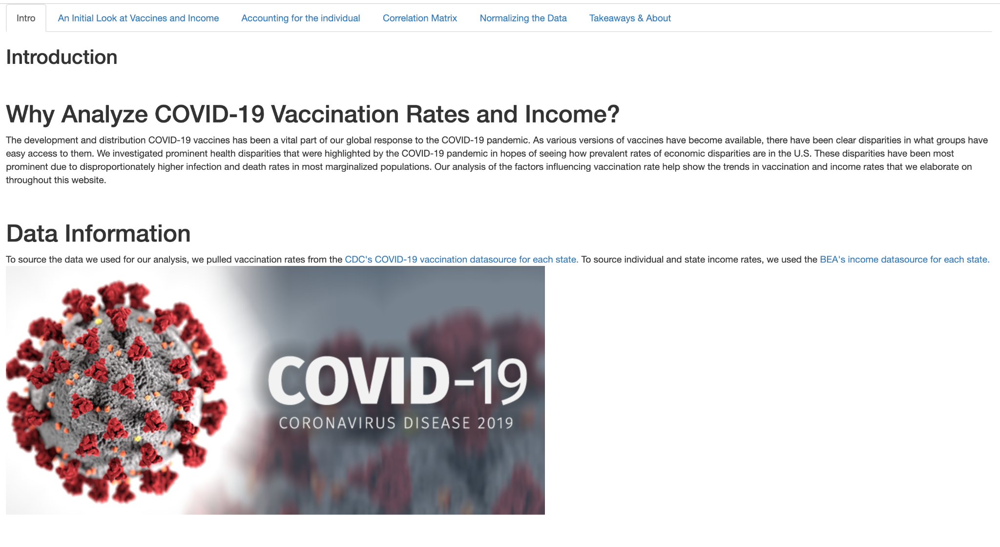
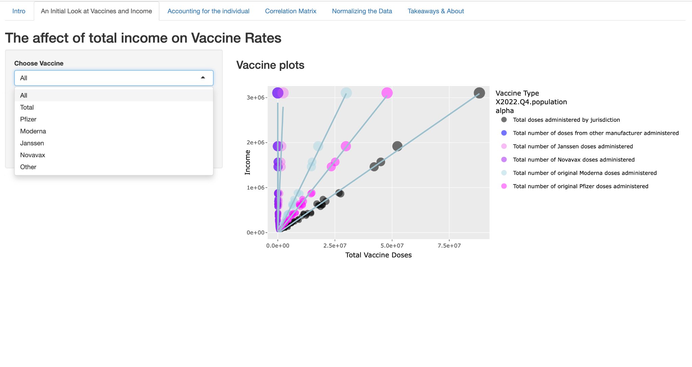
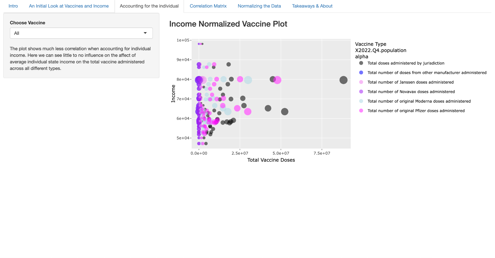
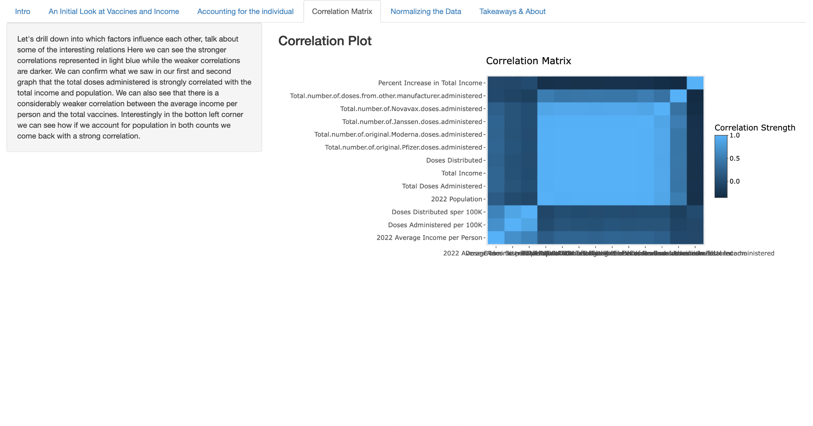
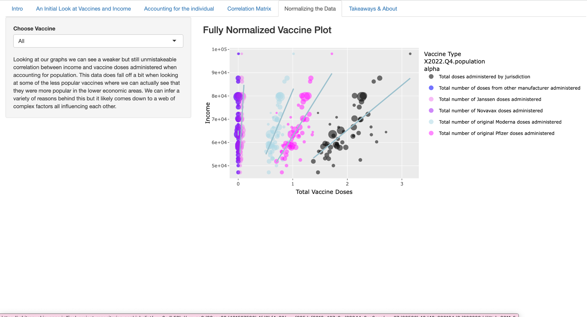
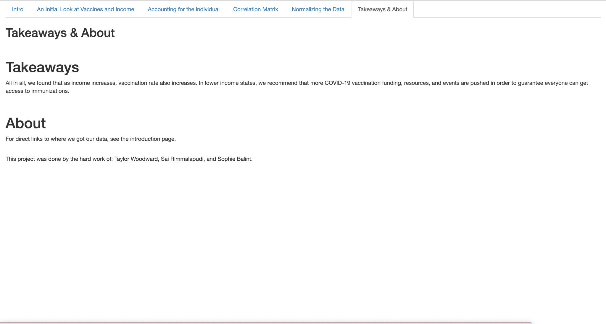

# COVID-19 Vaccination Disparity Study — Case Study (Live App, No Public Source)

**Live app:** https://arbitrary.shinyapps.io/final-project-repositories-sophiebalint/_w_6adb59bd/  
**Timeline:** Apr 2023 – Jun 2023  
**Affiliation:** University of Washington Information School  
**Stack:** R (analysis & visualization), Shiny (interactive app)

> This repository documents the project and links to the live app. The source code is not public; this case study summarizes scope, methods, and results.

---

## Overview

This project analyzes how **economic factors** relate to **COVID-19 vaccination rates** across U.S. regions. We combined publicly available **CDC vaccination data** with regional **economic indicators** to explore correlations and trends, then published an **interactive Shiny app** so users can slice the data dynamically.

---

## Objectives

- Bring together vaccination and economic data into a **single, clean dataset** for analysis.  
- Quantify and visualize **relationships** between vaccination rates and selected economic measures.  
- Provide a **self-serve interactive interface** (Shiny) for regional exploration and comparison.  
- Produce a **Data Nutrition Label** to document data provenance, coverage, limitations, and appropriate use.

---

## Data & Preparation

- **Sources:** CDC vaccination rates and publicly available **economic indicators** at regional levels.  
- **Integration:** Normalized field names and merged disparate inputs into **one CSV** to maintain integrity and simplify downstream analysis.  
- **Quality checks:** Verified joins, handled missing values, standardized region identifiers, and ensured consistent date coverage.

*(Note: Exact raw datasets are not redistributed in this repository.)*

---

## Methods

- **Exploratory analysis** and **statistical summaries** in R to examine correlations between vaccination rates and economic variables.  
- **Visualizations** (time series, regional comparisons) to surface disparities and patterns.  
- **Interactive Shiny app** to filter by region and variables, with dynamic plots and tables.  
- **Data Nutrition Label** created to capture data lineage, assumptions, collection windows, and known caveats.

---

## The Shiny App (how to explore)

1. Open the live app: **<https://arbitrary.shinyapps.io/final-project-repositories-sophiebalint/_w_6adb59bd/>**  
2. Choose a **region** and one or more **economic indicators** to compare against vaccination rates.  
3. Use the controls to **filter time windows** or subgroups; charts and tables update interactively.  
4. Hover over points to see values; export views where available.

---

## Findings (high level)

- Identified **correlations** between vaccination rates and selected **socioeconomic measures** that varied across regions.  
- The app supports **regional comparisons** and makes disparities visible to non-technical audiences.  
- The **Data Nutrition Label** clarifies how to interpret results responsibly and where caution is warranted.

*(Quantitative effect sizes are not included here; see the app for visual exploration.)*

---

## Limitations

- **Observational** analysis: correlations do not imply causation.  
- **Data coverage** may vary by region and date; some indicators have missing or lagged values.  
- **Granularity** is limited to the most consistent regional breakdowns available across sources.

---

## My Contribution

- Consolidated **multi-source data** into a single CSV with integrity checks.  
- Built the **interactive Shiny app** for dynamic exploration.  
- Performed **statistical analysis** in R and authored a **Data Nutrition Label** to document transparency and limitations.  
- Summarized insights relevant to **public health and socioeconomic context**.

---

## Screenshots

**Intro & Data Sources**  

**Vaccines vs. Income (by manufacturer)**  

**Income-Normalized Vaccine Plot**  

**Correlation Matrix**  

**Fully Normalized Vaccine Plot**  

**Takeaways & About**  

---

## Acknowledgements

University of Washington Information School. Data from the **CDC** and public **economic datasets** (attributed within the app and Data Nutrition Label).

